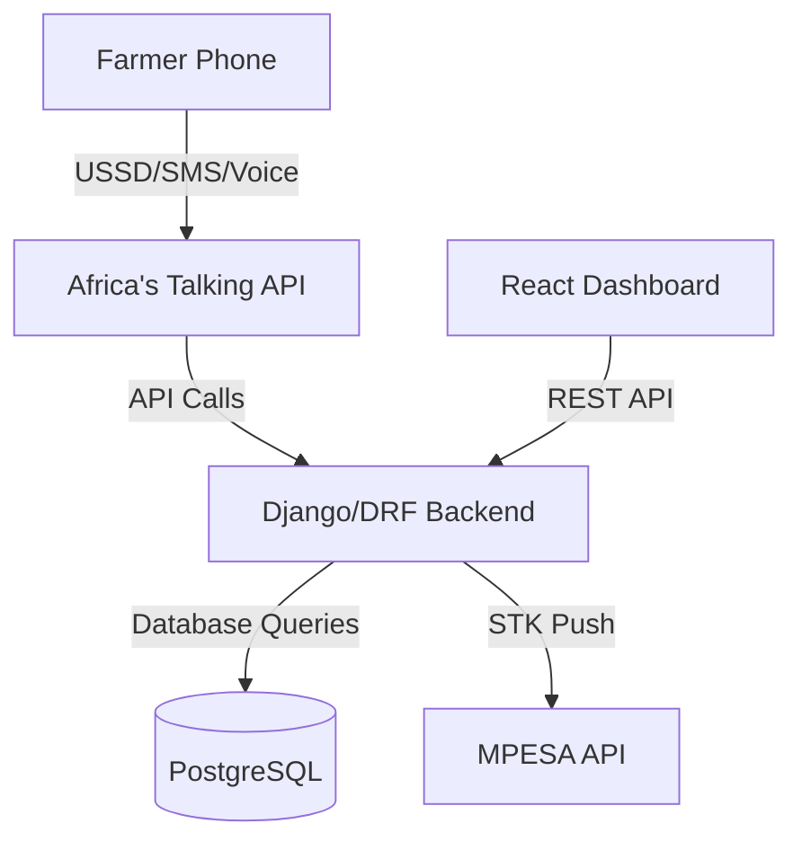

# CreditAgri+

> Empowering smallholder farmers with instant, accessible credit and community-driven guarantees.

[](LICENSE)

## 🌾 Project Overview

CreditAgri+ is a USSD-first micro-loans platform developed during the Africa's Talking Hackathon for Agritech Innovation. Our mission is to revolutionize agricultural financing by providing instant, accessible credit through familiar mobile channels (USSD, SMS, Voice) combined with a modern web dashboard.

### Key Features

- 📱 **Instant Loan Applications** via USSD menus
- 💰 **Automated Disbursements** using MPESA STK Push
- 🤝 **Community Guarantee Pools** for peer-backed lending
- 📊 **Basic Credit Scoring** with rule-based heuristics
- 🖥️ **React Dashboard** for both admins and farmers

---

## 📋 Table of Contents

1. [Objectives and Scope](#🎯-objectives-and-scope)
2. [Technical Architecture](#🏗️-technical-architecture)
3. [Getting Started](#🚀-getting-started)
4. [API Documentation](#🔌-api-documentation)
5. [USSD and STK Flows](#📱-ussd-and-stk-flows)
6. [Dashboard Features](#🎛️-dashboard-features)
7. [Contributing](#🤝-contributing)
8. [License](#📝-license)

## 🎯 Objectives and Scope

### Core Features

- USSD/Voice Onboarding & Loan Application
- Automated MPESA STK Push Disbursement
- CreditAgri Scoring (0-100 scale)
- Community Guarantee Pool System
- Automated Repayment Mechanism
- Interactive React Dashboard

### Future Roadmap

- AI/ML-based credit scoring refinements
- Carbon credit tracking & AgriPoints
- Multi-language IVR support
- Blockchain ledger integration

## 🏗️ Technical Architecture



### Tech Stack

- **Backend**: Django + Django REST Framework
- **Frontend**: React + MDB UI Kit
- **Database**: PostgreSQL
- **APIs**: Africa's Talking (USSD/SMS/Voice), MPESA Daraja
- **Infrastructure**: Docker + Docker Compose

## 🚀 Getting Started

### Prerequisites

- Docker & Docker Compose
- Node.js (v14+)
- Python 3.9+
- Africa's Talking & MPESA API credentials

### Quick Start

1. **Clone the Repository**

   ```bash
   git clone https://github.com/your-org/creditagri-plus.git
   cd creditagri-plus
   ```

2. **Environment Setup**

   ```bash
   cp .env.example .env
   # Edit .env with your API credentials
   ```

3. **Launch Services**

   ```bash
   docker-compose up --build
   ```

4. **Initialize Database**

   ```bash
   docker-compose exec backend python manage.py migrate
   ```

5. **Start Frontend**

   ```bash
   cd frontend && yarn install && yarn start
   ```

## 🔌 API Documentation

| Method | Endpoint | Description |
|--------|----------|-------------|
| POST | `/api/ussd/callback` | USSD menu handler |
| POST | `/api/pay/` | MPESA STK initiator |
| POST | `/mpesa/callback/` | Payment status handler |
| GET | `/api/dashboard/` | Dashboard data endpoint |

## 📱 USSD and STK Flows

### Loan Application

```
*384*123# → Language Selection → Farm Details → Credit Score → Loan Offer → STK Push
```

### Loan Repayment

```
*384*123*2# → Select Loan → Confirm Amount → STK Push
```

## 🎛️ Dashboard Features

### Admin Portal

- Real-time loan application pipeline
- Community pool management
- Performance analytics
- User management

### Farmer Portal

- Credit score tracking
- Loan status monitoring
- Repayment scheduling
- Transaction history

## 🤝 Contributing

We welcome contributions! Please follow these steps:

1. Fork the repository
2. Create your feature branch (`git checkout -b feature/AmazingFeature`)
3. Commit your changes (`git commit -m 'Add some AmazingFeature'`)
4. Push to the branch (`git push origin feature/AmazingFeature`)
5. Open a Pull Request

## 📝 License

This project is licensed under the MIT License - see the [LICENSE](LICENSE) file for details.

---

> Built with ❤️ for African Farmers

For support, contact us at support@creditagri.plus
